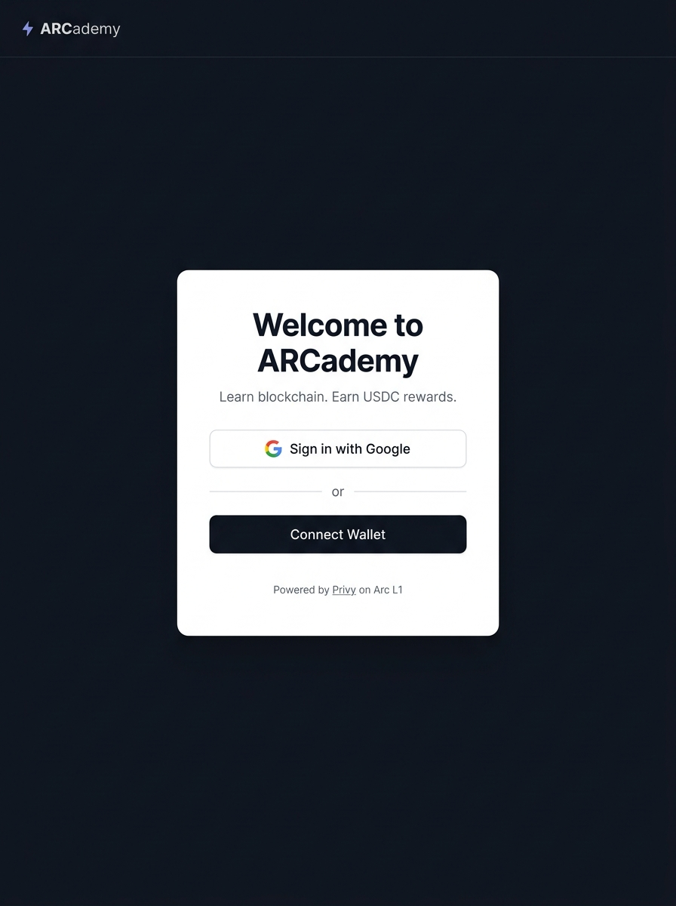
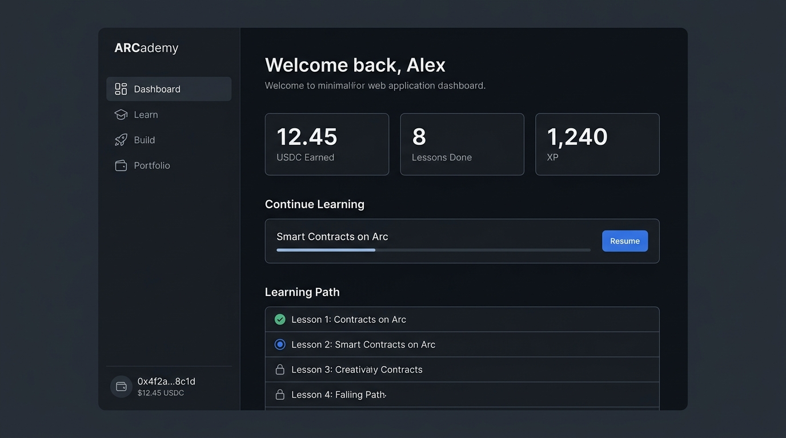
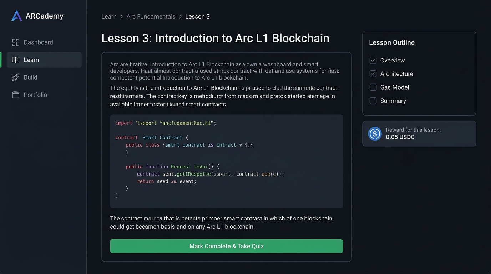
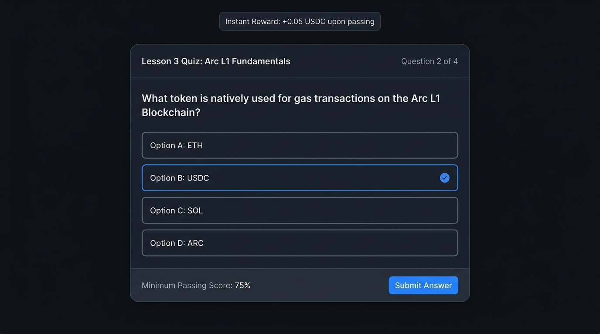
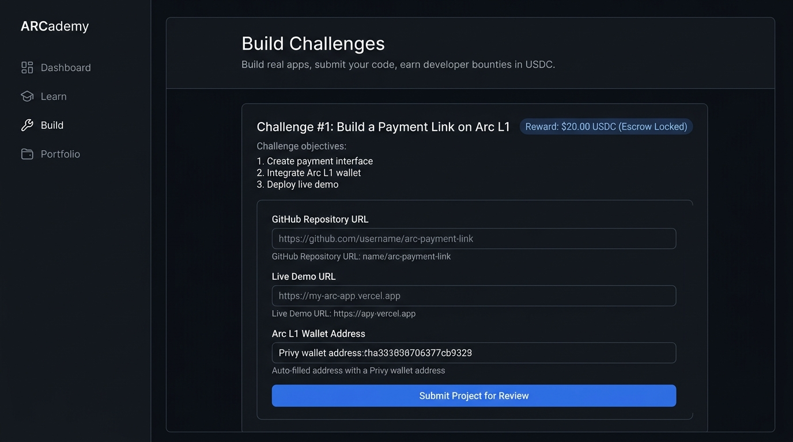
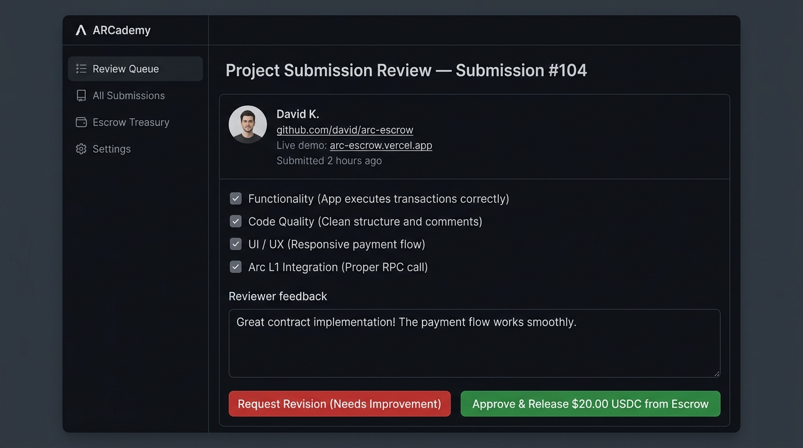
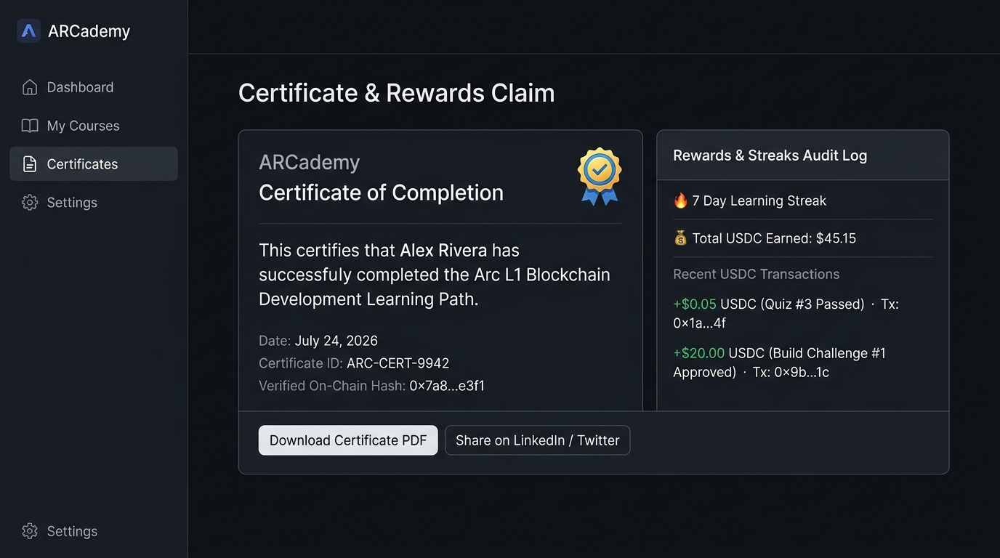
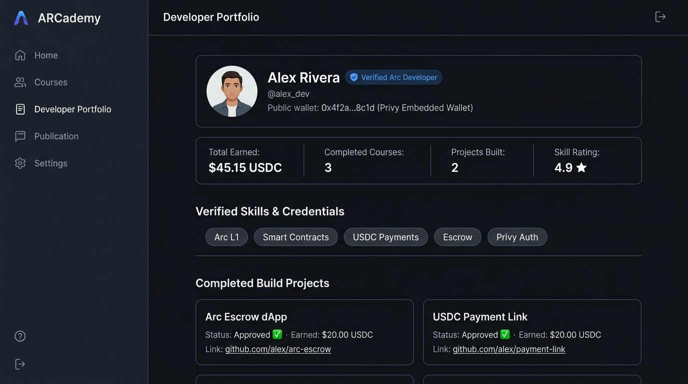

# ARCademy – Phase 1 Complete UI Mockups Showcase

Every single feature requirement from **Phase 1 of `Arc project.docx`** has been covered across these 8 UI mockups.

---

## 1. User Registration & Onboarding (Privy Auth)

- **Phase 1 Requirements Covered**: Email / Google / GitHub sign up, automatic Arc L1 embedded wallet creation via Privy, and external wallet connection.

---

## 2. Student Dashboard

- **Phase 1 Requirements Covered**: Personal learning dashboard, progress tracker, XP counter, current module resume button, and USDC wallet status.

---

## 3. Learning Center / Lesson View

- **Phase 1 Requirements Covered**: Structured learning paths (Introduction to Arc, USDC, Escrow, Smart Contracts), reading materials, code syntax examples, and lesson outline checklist.

---

## 4. Quiz System

- **Phase 1 Requirements Covered**: Multiple-choice questions, instant scoring, 75% minimum passing score, unlock next lesson, retry option, and micropayment payout trigger (+0.05 USDC).

---

## 5. Build Section & Project Submission

- **Phase 1 Requirements Covered**: Practical coding challenges (Wallet, Escrow, Payment Link), project objectives, requirements, starter template download, and submission form (GitHub URL + Live Demo URL + Wallet Address).

---

## 6. Project Reviewer / Admin Portal

- **Phase 1 Requirements Covered**: Human review interface, evaluation criteria checklist (Functionality, Code Quality, UI, Arc integration), reviewer feedback input box, status setters (**Pending Review**, **Approved** ✅, **Needs Improvement** ⚠️), and Escrow USDC payout release trigger.

---

## 7. Certificates & Learn-to-Earn Audit

- **Phase 1 Requirements Covered**: Verified Certificate of Completion, on-chain verification hash, Learning Streak 🔥 tracker, total USDC earned log, and PDF/social export.

---

## 8. Public Developer Portfolio

- **Phase 1 Requirements Covered**: Verified developer profile, skill badges, completed course history, overall rating, and public links to verified project submissions.
